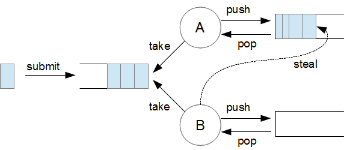

#  充分利用Java线程池

线程池是多线程编程中的核心概念，简单地说，它表示可用于执行任务的空闲线程的集合

<br>带来程序的性能提升，但多线程编程也有缺点 - 例如代码复杂性增加，并发问题，意外结果以及增加线程创建的开销。

<br>创建和启动线程可能是一个昂贵的过程。通过每次我们需要执行任务时重复此过程，我们会产生显着的性能成本 - 这正是我们尝试通过使用线程来改进的。

<br>为了更好地理解创建和启动线程的成本，让我们看看JVM在幕后实际做了什么：

* 它为一个线程堆栈分配内存，该堆栈为每个线程方法调用保存一个帧。

* 每个帧由局部变量数组，返回值，操作数堆栈和常量池组成。

* 一些支持本机方法的JVM也会分配本机堆栈。

* 每个线程都有一个程序计数器，告诉它处理器执行的当前指令是什么。

* 系统创建与Java线程对应的本机线程。

* 与线程相关的描述符被添加到JVM内部数据结构中。

* 线程共享堆和方法区域。

* 当然，所有这些的细节将取决于JMV和操作系统。

<br>此外，更多线程意味着系统调度程序需要做更多工作来决定接下来哪个线程可以访问资源。

**线程池通过减少所需的线程数量和管理其生命周期来帮助缓解性能问题。**

<br>本质上，线程保留在线程池中直到需要它们为止，之后它们执行任务并返回池以便以后重用。此机制在执行**大量小任务**的系统中特别有用

## Java线程池

<br>Java通过称为执行程序的对象提供自己的线程池模式实现。这些可以通过执行程序接口使用，也可以直接通过线程池实现使用 - 这样可以实现更精细的控制。

<br>在`java.util.concurrent`包中包含了以下接口：

* Executor - 执行任务的简单接口。
* ExecutorService  一个更复杂的接口，包含用于管理任务和执行程序本身的其他方法。
* ScheduledExecutorService - 使用调度任务执行的方法扩展ExecutorService。

<br>除了这些接口之外，该包还提供了Executors帮助程序类，用于获取执行程序实例以及这些接口的实现。

<br>通常，Java线程池由以下内容组成：

* 工作线程池，负责管理线程。
* 一个负责创建新线程的线程工厂。
* 等待执行的任务队列。

<br>在以下部分中，让我们看看为线程池提供支持的Java类和接口如何更详细地工作。

## The Executors Class and Executor Interface

<br>Executors:用于创建不同类型的线程池的工厂方法

<br>executor :最简单的线程池接口，具有一个单一`execute()`方法。

```java
Executor executor = Executors.newSingleThreadExecutor();
executor.execute(() -> System.out.println("Single thread pool test"));
```
<br>注意如何将语句写成lambda表达式 - 推断它是  Runnable 类型。 

<br>如果工作线程可用或将Runnable任务放在队列中等待线程可用，则运行execute()方法

<br>基本上，executor 替换了线程的显式创建和管理。

<br>Executors类中的工厂方法可以创建多种类型的线程池：

* newSingleThreadExecutor() - 一个线程池，只有一个线程具有无界队列，一次只执行一个任务。
* newFixedThreadPool() - 一个线程池，具有固定数量的线程，共享一个无界队列; 如果在提交新任务时所有线程都处于活动状态，则它们将在队列中等待，直到线程可用。
* newCachedThreadPool() - 一个在需要时创建新线程的线程池。
* newWorkStealingThreadPool() - 基于“工作窃取”算法的线程池，将在后面的部分中详细介绍。

<br>接下来，我们来看看ExecutorService接口的其他功能。

## ExecutorService

创建ExecutorService的一种方法是使用Executors类中的工厂方法：

`ExecutorService  executor  =  Executors.newFixedThreadPool(10);`

<br>除了 execute()方法之外，该接口还定义了一个类似的submit（）方法，该方法可以返回Future对象：

```java
Callable<Double> callableTask = () -> {
    return employeeService.calculateBonus(employee);
};
Future<Double> future = executor.submit(callableTask);
// execute other operations
try {
    if (future.isDone()) {
        double result = future.get();
    }
} catch (InterruptedException | ExecutionException e) {
    e.printStackTrace();
}
```

<br>Future接口可以返回Callable对象的任务结果，还可以显示任务执行的状态。

<br>当没有等待执行的任务时，ExecutorService不会自动销毁，因此要显式关闭它，可以使用shutdown()或shutdownNow() api

`executor.shutdown();`

## ScheduledExecutorService

<br>这是ExecutorService的子接口- 它添加了用于调度任务的方法：

`ScheduledExecutorService executor = Executors.newScheduledThreadPool(10);`

<br>schedule()方法指定要执行的任务、延迟值和值的时间单位:

`Future<Double> future = executor.schedule(callableTask, 2, TimeUnit.MILLISECONDS);`

<br>此外，该接口定义了另外两种方法：

```java
executor.scheduleAtFixedRate(
  () -> System.out.println("Fixed Rate Scheduled"), 2, 2000, TimeUnit.MILLISECONDS);
executor.scheduleWithFixedDelay(
  () -> System.out.println("Fixed Delay Scheduled"), 2, 2000, TimeUnit.MILLISECONDS);
```

<br>scheduleAtFixedRate()方法在延迟2毫秒后执行任务，然后每2秒重复一次。
类似地，scheduleWithFixedDelay()方法在2毫秒后开始第一次执行，然后在前一次执行结束后2秒重复执行任务。

<br>在下面的部分中，我们还将介绍ExecutorService接口的两个实现:ThreadPoolExecutor和ForkJoinPool。

## ThreadPoolExecutor

<br>此线程池实现添加了配置参数的功能，以及可扩展性挂钩。创建ThreadPoolExecutor对象最方便的方法是使用Executors工厂方法：

`ThreadPoolExecutor executor = (ThreadPoolExecutor) Executors.newFixedThreadPool(10);`

<br>以这种方式，线程池被预先配置用于最常见的情况。可以通过设置参数来控制线程数：

<br>corePoolSize和maximumPoolSize - 表示线程数的边界
<br>keepAliveTime - 确定保持额外线程活动的时间

<br>再深入挖掘一下，下面是如何使用这些参数。

<br>如果提交了一个任务，并且执行的线程少于corePoolSize ，那么就会创建一个新线程。如果有超过[corePoolSize]但小于[maximumPoolSize]的线程在运行，
并且任务队列已满，则会发生相同的情况。如果有超过[corePoolSize]的线程，这些线程的空闲时间超过了[keepAliveTime]，它们将被终止。

<br>在上面的例子中，newFixedThreadPool()方法创建了一个线程池，corePoolSize=maximumPoolSize =10, keepAliveTime为0秒。

<br>如果使用newCachedThreadPool()方法，将创建一个线程池，其最大池大小为整数。MAX_VALUE和保持时间60秒:

`ThreadPoolExecutor cachedPoolExecutor  = (ThreadPoolExecutor) Executors.newCachedThreadPool();`

<br>参数也可以通过构造函数或setter方法设置：

```java
ThreadPoolExecutor executor = 
    new ThreadPoolExecutor(4, 6, 60, TimeUnit.SECONDS, new LinkedBlockingQueue<Runnable>());
executor.setMaximumPoolSize(8);
```

<br>ThreadPoolExecutor的子类是ScheduledThreadPoolExecutor类，它实现ScheduledExecutorService接口。您可以使用newScheduledThreadPool（）工厂方法创建此类型的线程池：

`ScheduledThreadPoolExecutor executor = (ScheduledThreadPoolExecutor) Executors.newScheduledThreadPool(5);`

<br>这将创建一个corePoolSize为5 的线程池，一个无界的maximumPoolSize  和一个0秒的keepAliveTime。

<br>自定义线程池 

<br>若Executors。工厂类无法满足我们的需求，可以自己去创建自定义的线程池，其实Executors工厂类里面的创建线程方法其 。部实现均是用了ThreadPoolExecutor的这个类，这个类可以自定义线程构造方法如下：
```java
public ThreadPoolExecutor(int corePoolSize，
      int maximumPoolSize，
      long keepAlive Time，
      TimeUnit unit，
      BlockingQueue < Runnable > workQueue，
      ThreadF actory threadFactory，
      RejectedExecutionHandler handler
 ){ .. }
executor.setMaximumPoolSize(8);
```

<br>这个构造方法对于队列是什么类型的比较关键： 

<br>1.  在使用有界队列时，若有新的任务需要执行，如果线程池实际线程数小于corePoolSize，则优先创建线程，若大于corePoolSize，则会将任务加入队烈，若队列已满，则在总线程数不天于maximumPoolSize
的前提下，创建新的线程，若线程数大于maximumPoolSize，则执行拒绝策略。或其他百定义方式 

<br>2.  无界的任务队列时：，的LinkedBlockingQueue。与有界队列相比，除非系统资源耗尽，否则无界的在务队列不存在任务入队失败的情况。当有新任务到来，系统的线程数小于corePoolSize
时，则新建线程执行任务。当达到corePoolSize后;就不会继续增加。若后续仍有新的在加入，而有没有空闲的线程资源，则任务直接进入队列等待。若任务创建和处理的速度差异很大，无界队列会保持快速增长，直到耗尽系统内存 

<br>3.  JDK拒绝策略： 
* AbortPolicy：直接抛出异常组织系统正常工作 
* CallerRunsPolicy：只要线程池未关闭，该策略直接在调用者线程中，运行当前被丢弃的任务 
* DiscardOldestPolicy：丢弃最老的一一个请求，

<br>尝试再次提交当前任务 .DiscardPolicy：丢弃无法处理的任务，不给予任何处理。 

如果需要自定义拒绝策略可以实现RejectedExecutionHandler接口 

## ForkJoinPool

<br>线程池的另一个实现是ForkJoinPool类。这实现了ExecutorService接口，Java 7中引入的fork/join框架的核心组件。

<br>fork/join框架基于“工作窃取算法”。简单地说，这意味着耗尽任务的线程可以“窃取”其他繁忙线程的工作。

<br>ForkJoinPool非常适合在大多数任务创建其他子任务或从外部客户端向池中添加许多小任务时使用。

<br>使用这个线程池的工作流通常是这样的:

* 创建一个ForkJoinTask子类

* 根据条件将任务拆分为子任务

* 调用任务

* 加入每项任务的结果

* 创建类的实例并将其添加到池中

<br>要创建一个ForkJoinTask，如果需要返回一个结果，您可以选择它更常用的子类之一RecursiveAction或RecursiveTask。

<br>让我们实现一个类的例子，它扩展了RecursiveTask，并通过根据阈值将数字分割为子任务来计算其阶乘:

```java
public class FactorialTask extends RecursiveTask<BigInteger> {
    private int start = 1;
    private int n;
    private static final int THRESHOLD = 20;
    // standard constructors
    @Override
    protected BigInteger compute() {
        if ((n - start) >= THRESHOLD) {
            return ForkJoinTask.invokeAll(createSubtasks())
              .stream()
              .map(ForkJoinTask::join)
              .reduce(BigInteger.ONE, BigInteger::multiply);
        } else {
            return calculate(start, n);
        }
    }
}
```

<br>这个类需要实现的主要方法是重写的compute（）方法，它连接每个子任务的结果。

<br>实际的拆分是在createSubTasks（）方法中完成的：

```java
private Collection<FactorialTask> createSubtasks() {
    List<FactorialTask> dividedTasks = new ArrayList<>();
    int mid = (start + n) / 2;
    dividedTasks.add(new FactorialTask(start, mid));
    dividedTasks.add(new FactorialTask(mid + 1, n));
    return dividedTasks;
}
```

<br>最后，calculate（）方法包含范围中值的乘法：

```java
private BigInteger calculate(int start, int n) {
    return IntStream.rangeClosed(start, n)
      .mapToObj(BigInteger::valueOf)
      .reduce(BigInteger.ONE, BigInteger::multiply);
}
```

<br>接下来，可以将任务添加到线程池：

```java
ForkJoinPool pool = ForkJoinPool.commonPool();
BigInteger result = pool.invoke(new FactorialTask(100));
```

## ThreadPoolExecutor与ForkJoinPool

<br>乍一看，fork/join框架似乎带来了更好的性能。然而，根据您需要解决的问题的类型，情况可能并不总是如此。

<br>在选择线程池时，还必须记住，创建和管理线程以及将执行从一个线程切换到另一个线程会导致开销。

<br>ThreadPoolExecutor提供了对线程数量和每个线程执行的任务的更多控制。这使得它更适合于在自己的线程上执行的较大任务数量较少的情况。

<br>相比之下，ForkJoinPool基于线程“窃取”其他线程的任务。正因为如此，当任务可以分解成更小的任务时，最好使用它来加速工作。

<br>为了实现工作窃取算法，fork/join框架使用两种类型的队列:

* 所有任务的中心队列

* 每个线程的任务队列

<br>当线程在自己的队列中耗尽任务时，它们试图从其他队列中获取任务。为了提高进程的效率，线程队列使用deque(双端队列)数据结构，在一端添加线程，从另一端“窃取”线程。

<br>以下是对这个过程的一个很好的可视化表示:



<br>与此模型相比，ThreadPoolExecutor仅使用一个中央队列。

<br>最后要记住的是，选择ForkJoinPool仅在任务创建子任务时才有用。否则，它将与ThreadPoolExecutor的功能相同，但需要额外的开销。

## 跟踪线程池执行

<br>现在，我们已经对Java线程池生态系统有了很好的基本了解，接下来让我们更深入地了解在使用线程池的应用程序执行期间发生了什么。

<br>通过在FactorialTask的构造函数和calculate()方法中添加一些日志语句，你可以看到调用顺序:

```js
13:07:33.123 [main] INFO ROOT - New FactorialTask Created
13:07:33.123 [main] INFO ROOT - New FactorialTask Created
13:07:33.123 [main] INFO ROOT - New FactorialTask Created
13:07:33.123 [main] INFO ROOT - New FactorialTask Created
13:07:33.123 [ForkJoinPool.commonPool-worker-1] INFO ROOT - New FactorialTask Created
13:07:33.123 [ForkJoinPool.commonPool-worker-1] INFO ROOT - New FactorialTask Created
13:07:33.123 [main] INFO ROOT - New FactorialTask Created
13:07:33.123 [main] INFO ROOT - New FactorialTask Created
13:07:33.123 [main] INFO ROOT - Calculate factorial from 1 to 13
13:07:33.123 [ForkJoinPool.commonPool-worker-1] INFO ROOT - New FactorialTask Created
13:07:33.123 [ForkJoinPool.commonPool-worker-2] INFO ROOT - New FactorialTask Created
13:07:33.123 [ForkJoinPool.commonPool-worker-1] INFO ROOT - New FactorialTask Created
13:07:33.123 [ForkJoinPool.commonPool-worker-2] INFO ROOT - New FactorialTask Created
13:07:33.123 [ForkJoinPool.commonPool-worker-1] INFO ROOT - Calculate factorial from 51 to 63
13:07:33.123 [ForkJoinPool.commonPool-worker-2] INFO ROOT - Calculate factorial from 76 to 88
13:07:33.123 [ForkJoinPool.commonPool-worker-3] INFO ROOT - Calculate factorial from 64 to 75
13:07:33.163 [ForkJoinPool.commonPool-worker-3] INFO ROOT - New FactorialTask Created
13:07:33.163 [main] INFO ROOT - Calculate factorial from 14 to 25
13:07:33.163 [ForkJoinPool.commonPool-worker-3] INFO ROOT - New FactorialTask Created
13:07:33.163 [ForkJoinPool.commonPool-worker-2] INFO ROOT - Calculate factorial from 89 to 100
13:07:33.163 [ForkJoinPool.commonPool-worker-3] INFO ROOT - Calculate factorial from 26 to 38
13:07:33.163 [ForkJoinPool.commonPool-worker-3] INFO ROOT - Calculate factorial from 39 to 50
```

<br>在这里，您可以看到已经创建了几个任务，但是只有三个工作线程——因此这些线程会被池中的可用线程接收。

<br>还要注意对象本身是如何在主线程中创建的，然后才被传递到池中执行。

##  使用线程池的潜在风险

<br>虽然线程池提供了显著的优势，但是在使用线程池时，您也会遇到一些问题，例如:

* 使用太大或太小的线程池,如果线程池包含太多线程，这可能会显著影响应用程序的性能;另一方面，线程池太小可能不会带来预期的性能提高

* 死锁可以像其他多线程一样发生;例如，一个任务可能在没有可用线程的情况下等待另一个任务完成;这就是为什么避免任务之间的依赖关系是很重要的

* 排队很长的任务，为了避免阻塞线程太长时间，您可以指定一个最大等待时间，在此之后任务被拒绝或重新添加到队列中

<br>为了减少这些风险，您必须根据线程池将要处理的任务仔细选择线程池类型和参数。压力测试您的系统也非常值得获得一些实际数据，以了解线程池在负载下的行为。


## 结论

<br>线程池通过简单地将任务的执行与线程的创建和管理分离开来，提供了显著的优势。此外，如果使用得当，它们可以大大提高应用程序的性能。

<br>而且，Java生态系统的伟大之处在于，如果您学会正确地利用线程池并充分利用它们，那么您就可以利用一些最成熟的、经过实战检验的线程池。