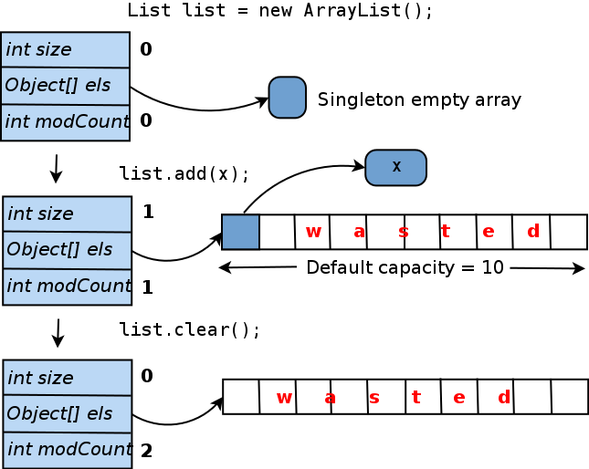
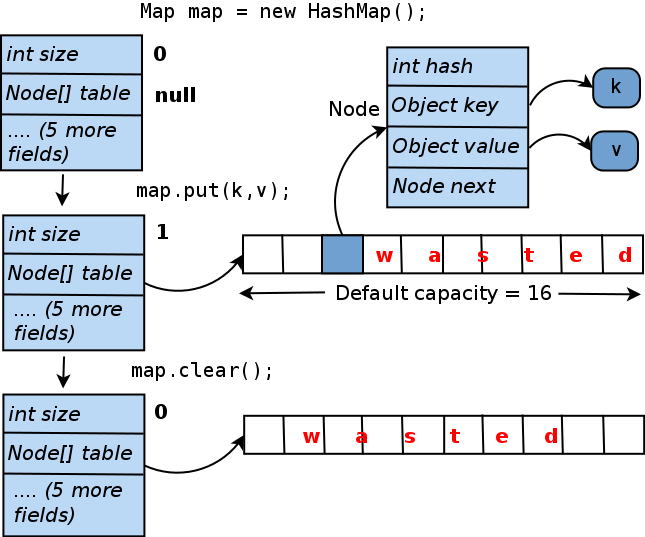
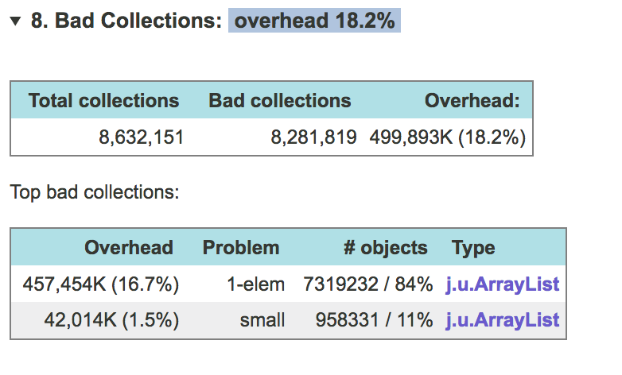
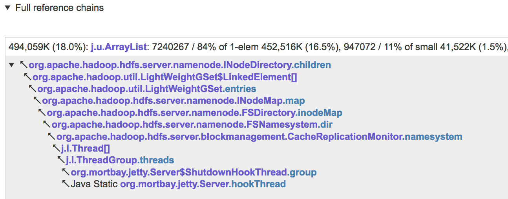

# 如何防止Java集合浪费内存
<br>JDK集合是列表和映射的标准库实现。如果你看看一个典型的大的Java应用程序的内存快照，你会看到成千上万甚至数百万的实例
`java.util.ArrayList`，`java.util.HashMap`等集合是在内存中的数据存储和操作是必不可少的。但是你有没有考虑过应用程序中的所有集合是否都以最佳方式使用内存？
换句话说：如果您的Java应用程序因臭名昭着OutOfMemoryError或经历过长时间的GC暂停而崩溃。您是否检查了其收集内存浪费？如果你的回答是“不”或“不确定”，请继续阅读。

<br>首先，请注意JDK集合的内部结构并不神奇。它们是用Java编写的。他们的源代码随JDK一起提供，因此您可以在IDE中打开它。它也可以在网上轻松找到。而且，事实证明，在优化内存占用时，大多数集合都不是很复杂。

<br>例如，考虑一个最简单和最流行的集合类：`java.util.ArrayList`。在内部，每个都ArrayList维护一个Object[] elementData数组。这就是存储列表元素的位置。我们来看看如何管理这个数组。

<br>当你创建一个ArrayList默认构造，即调用new ArrayList()，  elementData 被设置为指向一个单独的共享零大小的数组（elementData可能也被设置为null，而是一个单阵列提供了一些小的实现优势）。
将第一个元素添加到列表后，将elementData 创建一个真实的唯一数组，并将提供的对象插入其中。为了避免每次添加新元素时调整数组大小，
都会创建长度为10（“默认容量”）的数组。这里有一个问题：如果你从未向此添加更多元素ArrayList，则elementData 数组中的10个插槽中的9个将保持为空。
即使您稍后清除此列表，内部数组也不会缩小。下图总结了这个生命周期：



<br>浪费了多少内存？从绝对意义上讲，它计算为（对象指针大小）* 9.如果使用HotSpot JVM（随Oracle JDK一起提供），指针大小取决于最大堆大小
[请参阅](https://blog.codecentric.de/en/2014/02/35gb-heap-less-32gb-java-jvm-memory-oddities/)。
通常，如果指定-Xmx小于32千兆字节，则指针大小为4个字节; 对于更大的堆，它是8个字节。因此，ArrayList使用默认构造函数初始化，只添加了一个元素，浪费36或72个字节。

<br>实际上，空  ArrayList浪费也是内存，因为它不承载任何工作量，但是ArrayList对象本身的大小不是零并且比你想象的要大。这是因为，一方面，
由HotSpot JVM管理的每个对象都有一个12或16字节的标头，JVM将其用于内部目的。接下来，大多数集合对象包含size字段，指向内部数组或另一个“工作负载载体”对象的指针，
modCount用于跟踪内容修改的字段等。因此，即使是代表空集合的最小可能对象也可能需要至少32个内存字节。有些人比较喜欢ConcurrentHashMap。

<br>考虑另一个无处不在的集合类：`java.util.HashMap`。它的生命周期类似于  ArrayList以下内容并总结如下：



<br>如您所见，HashMap 只包含一个键值对会浪费15个内部数组插槽，这将转换为60或120个字节。这些数字很小，
但重要的是应用程序相对术语中所有集合丢失了多少内存。事实证明，某些应用程序可能会以这种方式浪费很多。
例如，作者分析的几个流行的开源Hadoop组件在某些情况下丢失了大约20％的堆！对于由经验不足的工程师开发并且不经常仔细检查性能的产品，
内存浪费可能更高。有足够的用例，例如，一棵巨大的树中90％的节点只包含一个或两个子节点（或根本没有节点），以及堆满了0,1或2个元素集合的其他情况。

<br>如果您在应用中发现未使用或未充分利用的集合，您如何解决这些问题？以下是一些常见的方法。这里我们的有问题的集合被假定为数据字段ArrayList引用Foo.list。

<br>如果大多数实例  list 从未使用过，请考虑延迟初始化它。因此以前看起来像的代码......

```java
void addToList(Object x) {
    list.add(x);
}
```

...应该重构成类似的东西

```java
void addToList(Object x) {
  getOrCreateList().add(x);
}
private list getOrCreateList() {
    // To conserve memory, we don't create the list until the first use
    if (list == null) list = new ArrayList();
    return list;
}
```

<br>请记住，您有时需要采取其他措施来解决可能的竞争问题。例如，如果你保持一个ConcurrentHashMap可以同时由多个线程更新的代码，
那么懒惰地初始化它的代码不应该允许两个线程意外地创建这个地图的两个副本：
```java
private Map getOrCreateMap() {
    if (map == null) {
        // Make sure we aren't outpaced by another thread
        synchronized (this) {
            if (map == null) map = new ConcurrentHashMap();
        }
    }
    return map;
}
```

<br>如果list或map的大多数实例仅包含少量元素，请考虑使用更合适的初始容量初始化它们，例如
```java
list = new ArrayList(4);  // Internal array will start with length 4
```

<br>如果您的集合在大多数情况下为空或仅包含一个元素（或键值对），则可以考虑一种极端形式的优化。它仅在集合在给定类中完全管理时才有效，
即其他代码无法直接访问它。我们的想法是，您将数据字段的类型从例如  List更改为更通用Object，
以便它现在可以指向真实列表，或直接指向唯一的列表元素。eg：
```java
// *** Old code ***
private List<Foo> list = new ArrayList<>();
void addToList(Foo foo) { list.add(foo); }
// *** New code ***
// If list is empty, this is null. If list contains only one element,
// this points directly to that element. Otherwise, it points to a
// real ArrayList object.
private Object listOrSingleEl;
void addToList(Foo foo) {
    if (listOrSingleEl == null) { // Empty list
        listOrSingleEl = foo;
    } else if (listOrSingleEl instanceof Foo) { // Single-element 
        Foo firstEl = (Foo) listOrSingleEl;
        ArrayList<Foo> list = new ArrayList<>();
        listOrSingleEl = list;
        list.add(firstEl);
        list.add(foo);
    } else { // Real, multiple-element list
        ((ArrayList<Foo>) listOrSingleEl).add(foo);
    }
}
```
<br>显然，这样的优化使您的代码可读性降低，难以维护。但是，如果你知道你将以这种方式节省大量内存，或者将摆脱长时间的GC暂停，那么它可能是值得的。

<br>这可能已经让你想到：我怎么知道我的应用程序中的哪些收藏浪费内存，以及多少？

<br>简短的回答是：如果没有适当的工具，很难找到。试图猜测大型复杂应用程序中数据结构使用或浪费的内存量几乎无法实现。
并且在不知道内存的确切位置的情况下，您可能会花费大量时间追逐错误的目标，同时您的应用程序会顽固地继续失败OutOfMemoryError。

<br>因此，您需要使用工具检查应用程序的堆。根据经验，分析JVM内存的最佳方式（以可用信息量与工具对应用程序性能的影响来衡量）是获取堆转储，
然后脱机查看。堆转储本质上是堆的完整快照。它可以通过调用jmap实用程序在任意时刻进行，
也可以将JVM配置为在失败时自动生成它OutOfMemoryError。如果您使用Google进行“JVM堆转储”，您将立即看到一堆文章详细解释如何获取转储。

<br>堆转储是一个大小与JVM堆大小相同的二进制文件，因此只能使用特殊工具读取和分析它。有许多这样的工具，包括开源和商业。
最流行的开源工具是Eclipse MAT; 还有VisualVM和一些不那么强大且鲜为人知的工具。
商业工具包括通用Java分析器：JProfiler和YourKit，以及专门为堆转储分析构建的一个工具，称为JXRay。

<br>与其他工具不同，JXRay会立即分析堆转储，以解决大量常见问题，例如重复字符串和其他对象，以及次优数据结构。
上述集合的问题属于后一类。该工具生成一个报告，其中包含HTML格式的所有收集信息。这种方法的优点是您可以随时随地查看分析结果，并轻松与他人分享。
这也意味着您可以在任何机器上运行该工具，包括数据中心中功能强大但功能强大的“无头”机器。

<br>JXRay以字节为单位计算开销（如果你摆脱特定问题，你可以节省多少内存），以及使用堆的百分比。它将具有相同问题的同一类的集合组合在一起......


<br>...然后将有问题的集合分组，这些集合可以通过相同的参考链从某个GC根目录访问，如下例所示



<br>了解哪些参考链和/或单个数据字段（例如INodeDirectory.children上面）指向浪费大部分内存的集合，允许您快速准确地查明导致问题的代码，然后进行必要的更改。

<br>总之，次优配置的Java集合可能会浪费大量内存。在许多情况下，这个问题很容易解决，但有时候，您可能需要以非平凡的方式更改代码以实现显着的改进。
很难猜测需要优化哪些集合才能产生最大的影响。为避免浪费时间优化代码的错误部分，您需要获取JVM堆转储并使用适当的工具对其进行分析。