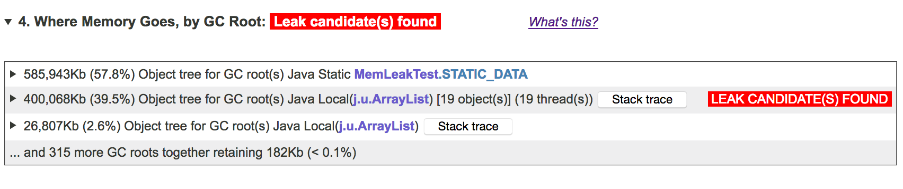

# 检测JVM堆转储中的内存泄漏
<br>Java流行的主要原因之一是垃圾收集。在运行时，任何无法从GC根目录访问的对象都将被自动销毁并回收其内存（迟早）。最常见的GC根是方法和静态数据字段中的局部变量; 
当GC根目录直接指向或通过一系列其他对象时，可以访问对象。因此，Java中的任何对象都无法真正“泄漏”，即运行程序无法访问，但耗尽内存 
无论如何都不会长时间使用。那么，为什么“内存泄漏”仍然是Java应用程序中内存的常见问题之一？如果你想知道它或者曾经努力试图理解为什么你的应用程序的使用内存不断增长，请继续阅读。

<br>简而言之，Java中的内存泄漏并不是真正的泄漏，  它们只是由于错误或次优代码而不受控制地增长的数据结构。人们可以争辩说，它们是语言及其生态系统的力量的副作用。在旧的，Java之前的日子里，
用C++编写一个大程序是一个缓慢的，有时是痛苦的过程，需要一个协调良好的开发人员团队的认真努力。目前，随着丰富的JDK库类和更丰富的第三方开源代码选择， 
以及强大的IDE，以及最重要的Java已经成为强大但“宽容”的语言，情况就不同了。松散的团队甚至是单个开发人员可以快速组建一个非常有用的应用程序。了解？他们可能对这款应用，或者至少是它的某些部分的工作原理知之甚少

<br>幸运的是，很大一部分问题可以通过单元测试来解决。经过良好测试的库和应用程序代码确保了良好的应用程序。但是，
有一点需要注意：单元测试很少用于模拟实际数据量和/或实际运行持续时间。这是导致内存泄漏的次优代码可以潜入的主要原因。

<br>内存泄漏的一个常见来源是用于避免慢速操作的内存缓存，例如从数据库中重复检索相同的对象。或者，在运行时生成的一些数据（例如操作历史）
可以周期性地转储到磁盘，但也保留在存储器中，以再次加速对它的访问。通过避免从外部存储器重复慢读取而以牺牲一些额外内存为代价来提高性能通常是明智的选择。
但是，如果您的缓存没有大小限制或其他清除机制; 外部数据量相对于JVM堆高; 如果应用程序运行的时间足够长 
您可能会遇到问题。首先，GC暂停将变得更频繁并且需要更长时间。然后，根据一些次要因素，有两种情况。
在第一个，应用程序将很快崩溃 OutOfMemoryError。在每次GC调用时通常会发生的第二个问题，可以回收一点内存，应用程序可能会遇到另一个问题：它不会崩溃，
但它会花费几乎所有时间在GC中，给人一种悬挂的印象。如果未监视使用的堆大小，则第二种情况可能难以诊断。但即使第一个展开，您如何知道哪个数据结构对其负责？

<br>幸运的是，由于这个问题并不新鲜，因此随着时间的推移已经开发出各种用于诊断内存泄漏的工具。它们分为两大类：在运行时连续收集信息的工具和分析单个JVM内存快照的工具，称为堆转储。

<br>通过检测（修改）应用程序代码和/或激活JVM中的内部数据收集机制，持续收集信息的工具。此类工具的示例是Visual VM或Mission Control，
它们都随JDK一起提供。原则上，这些工具在识别内存泄漏方面更加精确，因为它们可以区分大的，不变的数据结构和随时间不断增长的数据结构。
但是，在足够详细的级别收集此信息通常会导致高运行时开销，导致此方法在生产或甚至预生产测试中无法使用。

<br>因此，第二种选择：分析单个堆转储并识别“泄漏候选者”的数据结构，真的很吸引人。进行堆转储会暂停正在运行的JVM一段相对较短的时间。
每1 GB的堆使用生成转储大约需要2秒。因此，例如，如果您的应用使用4 GB，则会停止8秒。可以根据需要（使用jmap  JDK实用程序）
或应用程序失败时OutOfMemoryError  （如果使用`-XX:+HeapDumpOnOutOfMemoryError` 命令行选项启动JVM   ）  进行转储  。

<br>堆转储是一个大小与JVM堆大小相同的二进制文件，因此只能使用特殊工具读取和分析它。有许多这样的工具，包括开源和商业。
最流行的开源工具是Eclipse MAT; 还有VisualVM和一些不那么强大且鲜为人知的工具。商业工具包括通用Java分析器：JProfiler和YourKit，
以及专门为堆转储分析构建的一个工具，称为JXRay。

<br>与其他工具不同，JXRay会立即分析堆转储以解决大量常见问题，例如重复字符串和其他对象，次优数据结构，以及内存泄漏。该工具生成一个报告，
其中包含HTML格式的所有收集信息。因此，您可以随时随地查看分析结果，并轻松与他人分享。这也意味着您可以在任何机器上运行该工具，包括数据中心中功能强大但“无头”的机器。

<br>我们现在考虑一个例子。下面的简单Java程序模拟了以下情况：
<br>（a）大部分内存被大而不变的对象占用，（b）还有大量线程，所有线程都保持相同的，相对较小的数据结构（  ArrayList在我们的例子中）继续增长。
```java
import java.util.ArrayList;
import java.util.List;
public class MemLeakTest extends Thread {
  private static int NUM_ARRS = 300;
  private static byte[][] STATIC_DATA = new byte[NUM_ARRS][];
  static {  // Initialize unchanging static data
    for (int i = 0; i < NUM_ARRS; i++) STATIC_DATA[i] = new byte[2000000];
  }
  private static final int NUM_THREADS = 20;
  public static void main(String args[]) {
    MemLeakTest[] threads = new MemLeakTest[NUM_THREADS];
    for (int i = 0; i < NUM_THREADS; i++) {
      threads[i] = new MemLeakTest();
      threads[i].start();
    }
  }
  @Override
  public void run() {  // Each thread maintains its own "history" list
    List<HistoryRecord> history = new ArrayList<>();
    for (int count = 0; ; count++) {
      history.add(new HistoryRecord(count));
      if (count % 10000 == 0) System.out.println("Thread " + this + ": count = " + count);
    }
  }
  static class HistoryRecord {
    int id;
    String eventName;
    HistoryRecord(int id) {
      this.id = id;
      this.eventName = "Foo xxxxxxxxxxxxxxxxxxxxxxxxxxxxxxxxxx" + id;
    }
  }
}
```
<br>这个应用程序将不可避免地崩溃  OutOfMemoryError。要快速实现此目的并生成合理大小的堆转储，请编译此代码并按如下方式运行：
```properties
> java -Xms1g  -Xmx1g  -verbose：gc -XX：+ UseConcMarkSweepGC -XX：+ UseParNewGC \
 -XX ：OnOutOfMemoryError = “kill -9％p”  -XX：+ HeapDumpOnOutOfMemoryError \
 -XX ：HeapDumpPath = “./ memleaktest.hprof” MemLeakTest
```
<br>以上几个命令行标志值得一些解释：

<br>1建议使用Concurrent Mark-Sweep GC，至少在使用JDK8或更早版本时，因为这些JDK版本中的默认（并行）垃圾收集器在许多方面确实不是最理想的。
在这种特殊情况下，它会导致应用程序挣扎很长时间，直到它最终耗尽内存。

<br>2. 该  -XX:OnOutOfMemoryError="kill -9 %p"  标志告诉JVM在任何线程抛出时立即自杀OutOfMemoryError。这是每个多线程应用程序在生产中应该使用的非常重要的标志，
除非它专门设计用于处理  OutOfMemoryError  并继续运行（这很难正确实现）。 

<br>3. 该  -XX:HeapDumpPath 可以指定一个堆转储文件名或目录在哪里写的转储。在前一种情况下，
如果已存在具有相同名称的文件，则将覆盖该文件。在后者中，每个转储都将具有遵循该`java_pid<pid>.hprof`  模式的名称  。

<br> 当你启动上面的程序时，它将运行30秒左右，记录越来越多的GC暂停，直到其中一个线程抛出一个  
 OutOfMemoryError。此时，JVM将生成堆转储并停止。

<br>要使用JXRay分析转储，请`jxray.zip` 从`www.jxray.com`下载该  文件，解压缩并运行

 `> jxray.sh memleaks.hprof memleaks.html`

<br>在10-15秒内，JXRay将生成HTML文件。打开它，在顶部，您将立即看到该工具检测到的最重要问题的列表：


<br>如您所见，除了内存泄漏之外，该工具还发现了其他一些导致大量内存浪费的问题。在我们的基准测试中，这些问题 
重复字符串，空（全零）字节数组和数组重复
 是简单代码的副作用。然而，在现实生活中，许多未经优化的程序都表现出完全相同的问题，有时会造成类似的大量内存浪费！

<br>现在，让我们看看我们想要在这里说明的主要问题 - 内存泄漏。为此，我们跳转到报告的第4部分，然后单击以展开它：


<br>在此表中，每个可扩展行包含一个GC根，其中包含内存量。顶级GC根是我们的  STATIC_DATA 数组，但正如您所看到的，JXRay并不认为这是内存泄漏的来源。
但是，第二个GC根，它是ArrayList 我们的工作线程引用的所有相同s 的聚合   ，
被标记为泄漏候选。如果单击此行，您将立即看到一个引用链（或更确切地说，多个相同的引用链集中在一起），从而导致出现问题的对象：


<br>我们可以清楚地看到管理泄漏对象的数据结构。请注意，每个  ArrayList 只保留大约2％的内存，所以如果我们分别查看这些列表，
就很难意识到他们正在泄漏内存。但是，JXRay将这些对象视为相同，因为它们来自具有相同堆栈跟踪且具有相同引用链的线程。
一旦这些对象和它们保留的内存被聚合在一起，就可以更容易地看到实际发生的事情。

<br>JXRay如何确定哪些对象（通常是集合或数组）是潜在的内存泄漏源？简而言之，它首先从GC根开始扫描堆转储，并在内部生成对象树，
尽可能聚合相同的引用链。然后，它检查此树是否有引用其他对象的对象，以便（a）每个集合/数组的引用对象数足够高，并且（b）一起，
引用的对象保留足够大的内存量。事实证明，在实践中，令人惊讶的是，没有多少物体符合这些标准。因此，如果工具足够严重并且不会因许多误报而烦恼，该工具会发现真正的泄漏。

<br>当然，这种方法有其局限性。它无法告诉您给定的数据结构确实是泄漏，即它随着时间的推移而不断增长。但是，
即使不是这种情况，当更简单的事情已经优化时，上述内存模式值得寻找。在某些情况下，您可能会发现很多对象不值得保留在内存中，或者可以使用更紧凑的数据结构等。

<br>总之，Java应用程序可能存在一些数据结构无限增长的问题，这就是所谓的“Java内存泄漏”。有多种方法可以检测泄漏。
导致最小开销并导致误报不多的一种方法是堆转储分析。有些工具可以分析内存泄漏的JVM堆转储，而JXRay是需要用户付出最少努力的工具。